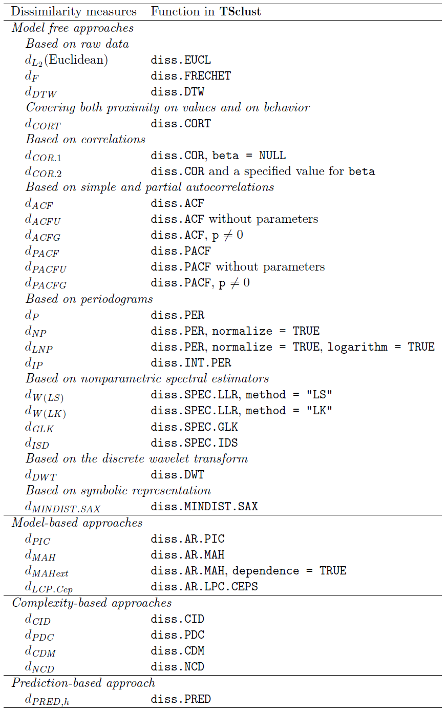

# Introduction
  The goal of this project is to discover Time Series analysis. We start with the data loading and creation of different types of object including ts, xts and zoo and proceed with data manipulation, conversion and visualization. Then we discover different algorithms of time series analysis like decomposition, forecasting and clustering. At the end we develop a practical example and build a Shiny application.

## Background

The function \strong{ts} for the core package \pkg{stats} \citep{R} is used to create time-series objects. These are vector or matrices with class of "ts" (and additional attributes) which represent data which has been sampled at equispaced points in time. In the matrix case, each column of the matrix data is assumed to contain a single (univariate) time series. Time series must have at least one observation, and although they need not be numeric there is very limited support for non-numeric series.

An xts object from package \CRANpkg{xts} \citep{xts} extends the S3 class \strong{zoo} from the package of the same name \citep{zoo}. Package \CRANpkg{zoo} is the creator for an \strong{S3} class of indexed totally ordered observations which includes irregular time series.

Similar to zoo objects, xts objects must have an ordered index. While zoo indexes cannot contain duplicate values, xts objects have optionally supported duplicate index elements since version 0.5-0. The xts class has one additional requirement, the index must be a time-based class. Currently supported classes include: 'Date', 'POSIXct', 'timeDate', as well as 'yearmon' and 'yearqtr' where the index values remain unique.

## Ethical Consideration for the Time Series ML Framework
As the goal of this report is only to research the time series methods, many aspects of the ethical ML framework do not directly apply. The time series data used here is open source and we can assume was collected in transparent ways. That being said, there is likely a large segment of the populace that can't take advantage of analysis presented in this report - we assume a low income population with limited access to internet and not STEM educated. If the outcome of this system were to be of more social impact, this would need to be use more appropriate datasets, analysis of which could be more advantageous to that population.

\newpage
# Time Series Data Manipulating and Visualizing
```{r setup, include=FALSE}
knitr::opts_chunk$set(dev = 'pdf')
```
```{r message=FALSE, warning=FALSE, include=FALSE, paged.print=FALSE}
knitr::opts_chunk$set(echo = TRUE, message=FALSE, warning=FALSE)

library("ggplot2")
library("readr")
library("dplyr")
library("forcats")
library(zoo)

set.seed(777)
```

```{r eval=FALSE, include=FALSE}
# Set directory to current script (works in R Studio only)
this.dir <- dirname(rstudioapi::getActiveDocumentContext()$path)
setwd(this.dir)
```

## Constructing TS object {#simpleTS}

In the following example (Fig \ref{fig:fig4}) we construct and plot a simple TS class:

```{r}
simpleTS <- c(-50, 175, 149, 214, 247, 237, 225, 329, 729, 809,
       530, 489, 540, 457, 195, 176, 337, 239, 128, 102, 232, 429, 3,
       98, 43, -141, -77, -13, 125, 361, -45, 184)
simpleTS <- ts(simpleTS, start = c(2001, 1), end = c(2008, 4), frequency = 4)
print(simpleTS)
```

```{r fig4, fig.width=5.5, fig.cap="Time Series ts class Example Plot"}
plot(simpleTS, ylab="", xlab="")
```

## Loading Stock Data  {#stocks5_aal}

There are many ways to load times data, but the fastest is to use \CRANpkg{zoo} that has many convinient utilities to manipulate times series data. This is especially convinient when dealing with complex stock data.

This is an example of loading and presenting of stock data using [Historical stock data for all current S&P 500 companies](https://www.kaggle.com/camnugent/sandp500). Stock market data can be interesting to analyze and as a further incentive, strong predictive models can have large financial payoff. Data has the following columns: 

 - Date - in format: yy-mm-dd
 - Open - price of the stock at market open (this is NYSE data so all in USD)
 - High - Highest price reached in the day
 - Low Close - Lowest price reached in the day
 - Volume - Number of shares traded
 - Name - the stock's ticker name

First we load the whole dataset as data frame:

```{r}
stocks5 <- read_csv(file="../../../data/all_stocks_5yr.csv.zip",col_names = TRUE)
stocks5$Name <- as.factor(stocks5$Name)
head(stocks5$Name)
```

As the name suggests we should have 500 (505 to be correct) stock names in the dataset. The code below extracts stock data of AAL (American Airlines Group Inc), converts it to \strong{zoo} object and plots it as multi-variate time series (Fig \ref{fig:fig5}).

```{r}
stocks5_aal <- stocks5[stocks5$Name=="AAL",c(1:6)]
stocks5_aal <- zoo(stocks5_aal[,2:6], stocks5_aal$date)
print(paste("Start date: ", start(stocks5_aal)))
print(paste("Last date: ", end(stocks5_aal)))
str(stocks5_aal)
```


```{r fig5, fig.width=5.5, fig.height=9, fig.cap="Multi-variate time series visualization of AAL stock"}
plot(stocks5_aal, xlab = "", nc = 1, main = "")
```

## Additional time series data sets

### Yahoo Science labeled time series
Yahoo Science labeled time series is a big Synthetic and real time-series with labeled anomalies, it should be downloaded and used locally.
[Yahoo Science labeled time series](https://github.com/ivbsoftware/CSDA1040-project-3/blob/master/data/orig/ydata-labeled-time-series-anomalies-v1_0.zip)

### NAB Data Corpus
[NAB Data Corpus](https://github.com/numenta/NAB/tree/master/data) is a large dataset of ordered, timestamped, single-valued metrics. All data files contain anomalies, unless otherwise noted. This data better be loaded from github directly to R script.


```{r eval=FALSE, include=FALSE}
tt1 <- read_csv(file="../../../data/NAB_data/realTraffic/TravelTime_387.csv",col_names = TRUE)

require(xts)
tt1_xts <- xts(tt1$value,tt1$timestamp)
plot(tt1_xts)
w <- tt1_xts[endpoints(tt1_xts, "days")]
m <- decompose(ts(w, frequency = 7))
plot(m$figure)
plot(m)

f <- decompose(apply.weekly(tt1_xts))s
f$figure

```

# Time Series Methods Showcase

## Time series decomposition
Time series decomposition is to decompose a time series into trend, seasonal, cyclical and irregular components. 
Frequency represents data which has been sampled at equispaced points in time:

 - frequency=7: a weekly series
 - frequency=12: a monthly series
 - frequency=4: a quarterly series

To decompose a time series into components:

 - Trend component: long term trend
 - Seasonal component: seasonal variation
 - Cyclical component: repeated but non-periodic fluctuations
 - Irregular component: the residuals

A \strong{simpleTS} time series object was constructed in section [Constructing TS object](#simpleTS). It is used below as an example to demonstrate time series decomposition (Fig \ref{fig:fig6}). It was constructed to have quarterly data and will be decomposed with frequency 4.

```{r fig6, fig.cap="Decomposition of cyclic object example", fig.width=5.5}
m <- decompose(simpleTS)
plot(m)
```

A more complex an realistic example of time series manipulation and decomposition presented below. We will use 'open' series of the object AAL stock taken directly from Yahoo Finance using \CRANpkg{tseries} \citep{tseries} package instead of data created in section [Loading Stock Data](#stocks5_aal). The full daily chart of this series presented on (Fig. \ref{fig:fig7}). To decompose the series, code below calculates yearly cycles of the last years since 2010, data aggregated monthly (Fig. \ref{fig:fig8}).

```{r fig7, fig.cap="AAL dayly stock data since 2010", fig.width=5.5}
library("tseries")
AAL <- get.hist.quote(instrument = "AAL", start = "2010-01-01")
plot(AAL, xlab = "")
```

```{r fig8, fig.cap="Decomposition of 8 years AAL 'open' series", fig.width=5.5, fig.height=4}
require(xts)
last8 <- window(AAL$Open, start=as.Date("2010-01-01"), end=as.Date("2017-12-31"))
last8_mo <- aggregate(last8, as.yearmon, tail, 1)
m <- decompose(ts(last8_mo, frequency = 12))
years <- seq(2010, 2020, 1)
plot(m, xlab="", xaxt="n")
axis(1, at=1:9, labels=years[1:9], pos = -6.6)
```

## Time series forecasting

Time series forecasting is to forecast future events based on known past data. To forecast future events based on known past data For example, to predict the price of a stock based on its past performance. Popular models are:

 - Autoregressive moving average (ARMA)
 - Autoregressive integrated moving average (ARIMA)

Example on Fig. \ref{fig:fig3} shows forecasting using ARIMA model.

```{r fig3, fig.width=5.5, fig.cap="Cyclic Time Series Forecasting with ARIMA model", fig.height=4}
ff <- ts(last8_mo)
fit <- arima(ff, order=c(1,0,0), list(order=c(2,1,0), period=12))
fore <- predict(fit, n.ahead=18)

# error bounds at 95% confidence level
U <- fore$pred + 2*fore$se
L <- fore$pred - 2*fore$se

ts.plot(ff, fore$pred, U, L, col=c(1,2,4,4), lty = c(1,1,2,2), 
        xlab="", gpars = list(xaxt="n"))
axis(1, at=seq(from=1, to=121, by=12), labels=years[1:11])
legend("topleft", c("Actual", "Forecast", "Error Bounds (95% Confidence)"),
       col=c(1,2,4), lty=c(1,1,2), cex=0.5)
```

## Time series forecasting with forecast package

It is common practice to split the data into two parts, training and test data, where the training data is used to estimate any parameters of a forecasting method and the test data is used to evaluate its accuracy. To perform this task and also to test several additional forrecasting methods we used package \CRANpkg{forecast} \citep{forecast}.

Code below creates train and test data from the the previously obtained 'open' stock data for the last 8 years aggregated monthly. Then it fits the train data using several models and plots the fitting results in the Fig.\ref{fig:fig10}. It also plots  the test portion in red for easy comparision of prediction and real data.

```{r}
library(forecast)

# test data
test_x <- window(last8, start=as.Date("2016-12-20"))
test_x <- test_x[endpoints(test_x, "month")]
test_x <- ts(test_x, frequency = 12)
str(test_x)

#train data
x <- window(last8, end=as.Date("2016-12-31"))
x <- x[endpoints(x, "month")]
x <- ts(x, frequency = 12)
str(x)
```

```{r}
library(forecast)
if(!file.exists("./models.Rds")) {
  models <- list(
    mod_arima = auto.arima(x, ic='aicc', stepwise=FALSE),
    mod_exp = ets(x, ic='aicc', restrict=FALSE),
    mod_neural = nnetar(x, p=12, size=25),
    mod_tbats = tbats(x, ic='aicc', seasonal.periods=12),
    mod_bats = bats(x, ic='aicc', seasonal.periods=12),
    mod_stl = stlm(x, s.window=12, ic='aicc', robust=TRUE, method='ets'),
    mod_sts = StructTS(x)
    )
  saveRDS(models, file = "./models.Rds")
} else  {
  models <- readRDS("./models.Rds")
}
```

```{r fig10, fig.height=9, fig.width=6, fig.cap="AAL stock prediction vs reality using different forecasting methods"}
forecasts <- lapply(models, forecast, 12)
forecasts$naive <- naive(x, 12)
par(mfrow=c(4, 2))
for(f in forecasts){
  plot(f, xlab="", xaxt="n")
  lines(y=test_x[1:13], x=seq(from=(8-1/12), to=9, by=1/12)[1:13], col='red')
  axis(1, at=1:10, labels=years[1:10])
}
```

## Evaluating forecast accuracy
Because the test data is not used in determining the forecasts, it should provide a reliable indication of how well the model is likely to forecast on new data. he metrics used below are described in \citep{hyndman_forecasting:_2014}, also available online [here](https://otexts.com/fpp2/accuracy.html). The metrics are:

 - ME - Mean absolute error
 - RMSE - Root mean squared error
 - MAE - mean absolute erro
 - MPE - mean percentage error
 - MAPE - Mean absolute percentage error
 - MASE - mean absolute scaled error
 - Theil's U - Uncertainty coefficient

Code below (adaptation of [Timeseries analysis procedure and methods using R](https://stats.stackexchange.com/questions/140163/timeseries-analysis-procedure-and-methods-using-r)) calculates common forecast errors of the predictions made in the previous section.
 
```{r}
test_xx <- ts(test_x[2:13], start=c(8,1), frequency = 12)
acc <- lapply(forecasts, function(f){
  accuracy(f, test_xx)[2,,drop=FALSE]
})
acc <- Reduce(rbind, acc)
row.names(acc) <- names(forecasts)
acc <- acc[order(acc[,'MASE']),]
round(acc, 2)
```

## Intoduction in Time series clustering
In many real applications, the cluster analysis must be performed on time
series data. Clustering is an unsupervised learning task aimed to partition a set of unlabeled data objects
into homogeneous groups or clusters. Partition is performed in such a way that objects in the
same cluster are more similar to each other than objects in different clusters according to some
defined criterion. 

Those are some measures of distance/dissimilarity
 - Euclidean distance
 - Manhattan distance
 - Maximum norm
 - Hamming distance
 - The angle between two vectors (inner product)
 - Dynamic Time Warping (DTW) distance

### Example: Grouping together time series of similar types

The [dataset](http://kdd.ics.uci.edu/databases/synthetic_control/synthetic_control.data.html) contains 600 examples of control charts synthetically generated by the process developed by  \citet{alcock__1999}.  Each control chart is a time series with 60 values. The classes are organized as follows:
  
 - 1-100   Normal
 - 101-200 Cyclic
 - 201-300 Increasing trend
 - 301-400 Decreasing trend
 - 401-500 Upward shift
 - 501-600 Downward shift

Code below reads the series and shows example of each type of series (Fig. \ref{fig:fig11}):

```{r fig11, fig.height=4, fig.width=5.5, fig.cap="Different types of syntetic time series"}
controlCharts <- read.csv(
  "http://kdd.ics.uci.edu/databases/synthetic_control/synthetic_control.data", 
  header=F, sep="")

idx <- c(1, 101, 201, 301, 401, 501)
sample1 <- t(controlCharts[idx, ])
plot.ts(sample1, main = "")
```

Now we randomly sample n cases from each class, to make it easy for plotting:
```{r}
n <- 5
s <- sample(1:100, n)
idx <- c(s, 100+s, 200+s, 300+s, 400+s, 500+s)
sample2 <- controlCharts[idx,]
observedLabels <- c(rep(1,n), rep(2,n), rep(3,n), rep(4,n), rep(5,n), rep(6,n))
```

Next step is to compute DTW distances between the sample series and perform hierarchical clustering (Fig. \ref{fig:fig12}).
```{r fig12, fig.width=5.5, fig.height=4, fig.cap="Hierarhical clustering of syntetic time series using DTW distances"}
library(dtw)
distMatrix <- dist(sample2, method="DTW")
hc <- hclust(distMatrix, method="average")
plot(hc, labels=observedLabels, main="")

memb <- cutree(hc, k = 8)
table(observedLabels, memb)
```

### Example: Hierarchical clustering with Euclidean distance
```{r fig13, fig.width=5.5, fig.height=4, fig.cap="Hierarhical clustering of syntetic time series using Euclidean distances"}
myDist <- dist(sample2)
hc <- hclust(myDist, method = "ave")
plot(hc, labels = observedLabels, main = "")
```

Cut tree to get 8 clusters
```{r}
memb <- cutree(hc, k = 8)
table(observedLabels, memb)
```


## Advanced Time Series Clustering with TSclust Package
In Time Series anslysis the grouping of series plays a central role in many applications. Finding stocks that behave in a similar way, determining products with similar selling patterns, identifying countries with similar population growth or regions with similar temperature are some typical applications.Package \CRANpkg{TSclust} \citep{TSclust} was developed for Time Series clustering based on measures of dissimilarity. The package implemernts a variety of such measures that split in the following groups:

 1. Model-free approaches that measure proximity between TS based on closeness of values:
  + Minkowski distance.
  + Frechet distance.
  + Dynamic time warping distance (DTW).
  + ... many others.
 2. Model-based approaches that assume that the underlying models are generated from
specific parametric structures:
 + Piccolo distance - defines a dissimilarity measure in the class of invertible ARIMA processes
as the Euclidean distance.
 + Maharaj distance - based on hypotheses testing to determine whether or not two time
series have significantly different generating processes.
 3. Complexity-based approaches that based on comparing levels of complexity of
time series are presented in this section:
 + Normalized compression distance (NCD) - based on measuring of compression rates of the time series.
 + Permutation distribution clustering (PDC) - described in terms of divergence
between permutation distributions of order patterns in m-embedding of the original
series.
 + Complexity-invariant dissimilarity measure (CID) - intuitive, parameter-free, invariant to the complexity of time series, computationally more efficient and more accurate than methods above.
 4. Prediction-based approaches - dissimilarity measures
based on comparing the forecast densities for each series at a future horizon of interest, where the forecast are unknown and must be approximated from the data.

The full list of the dissimilarity methods, implemented in \CRANpkg{TCslust} borrowed from page 25 of \citep{TSclust} is presented on Fig. \ref{fig:plot_nn}.

```{r plot_nn, echo=FALSE, fig.cap="Dissimilarity measures implemented in TSclust", message=FALSE, warning=FALSE, out.width = "\\textwidth"}

```
 
### Example: Clustering based on model free approach

Let's test the diss.CORT dsstance method to separate 18 series from the syntetic dataset we used before. The resulting clusters presented on (Fig. \ref{fig:fig16}):

```{r fig16, fig.width=5.5, fig.height=4, fig.cap="Custering of time series using CORT distances based on proximity and behavior"}
library(TSclust)

set.seed(1234)
n <- 3
s <- sample(1:100, n)
idx <- c(s, 100+s, 200+s, 300+s, 400+s, 500+s)
sample3 <- ts(t(controlCharts[idx,]))

# create the true cluster solution for comparision
true_cluster <- rep(1:6, each = n)

# create distance matrix covering both proximity on values and behavior
IP.dis <- diss(sample3, "CORT")

# hierarchical cluster solution
clust <- hclust(IP.dis)
plot(clust, labels = true_cluster, main = "")
IP.hclus <- cutree(clust, k = 6)

# rate the solution based on the implemented cluster similarity
cluster.evaluation(true_cluster, IP.hclus)
```

## Time Series classification problem 
Time series classification problem is a classification model based on labelled time series and then use the model to predict the label of unlabelled time series. The way for time series classification with R is to extract and build features from time series data first, and then apply existing classification techniques, such as SVM, k-NN, neural networks, regression and decision trees, to the feature set. Feature Extraction is done by the following methods:

 -  Singular Value Decomposition (SVD)
 -  Discrete Fourier Transform (DFT)
 -  Discrete Wavelet Transform (DWT)
 -  Piecewise Aggregate Approximation (PAA)
 -  Perpetually Important Points (PIP)
 -  Piecewise Linear Representation
 -  Symbolic Representation

Below is the example of Decision Tree model use for time series classification (Fig. \ref{fig:fig15}):

```{r fig15, fig.width=24, fig.height=15, fig.cap="Decision Tree model use for time series classification", out.width="9in", out.height="5.5in", out.extra='angle=90'}

classId <- rep(as.character(1:6), each = 100)
newSc <- data.frame(cbind(classId, controlCharts))

library(party)
ct <- ctree(classId ~ ., data = newSc,
controls = ctree_control(minsplit = 20,
minbucket = 5, maxdepth = 5))
plot(ct)
```

Let's estimate the accuracy of the prediction:
```{r}
pClassId <- predict(ct)
table(classId, pClassId)
(sum(classId == pClassId))/nrow(controlCharts)
```

### Example: Grouping countries by prediction of interest rates

First lets create a sample plot of the prediction densities from which the distance is calculated, the prediction is done at an horizon h=6 steps (Fig. \ref{fig:fig17}):

```{r fig17, fig.width=5.5, fig.height=4, fig.cap="Sample plot of the prediction densities"}
data("interest.rates")
set.seed(35)

diss.PRED(interest.rates[, 13], interest.rates[, 16],
          h = 6, B = 2000, logarithm.x = TRUE,
          logarithm.y = TRUE, differences.x = 1, differences.y = 1, 
          plot = T)$L1dist
```

Now lets prepare the correct differences and logarithms for all the countries involved
in the dataset, then compute the distance at for the datase and printprediction dencities for all counties from the dataset (Fig. \ref{fig:fig18}). 

```{r fig18, fig.width=5.5, fig.height=5, fig.cap="Grouping countries by prediction of interest rates"}
diffs <- rep(1, ncol(interest.rates))
logs <- rep(TRUE, ncol(interest.rates))

set.seed(74)
dpred <- diss(interest.rates, "PRED", h = 6, B = 1200, 
              logarithms = logs, differences = diffs,  plot = T)
```

Code below perform hierarchical clustering and plots the dendogram (Fig. \ref{fig:fig19}).
```{r fig19, fig.width=5.5, fig.height=4, fig.cap="Grouping countries by prediction of interest rates"} 
hc.dpred <- hclust(dpred$dist)
plot(hc.dpred, main = "", sub = "", xlab = "", ylab = "")
```

## Time Series feature extraction with Discrete Wavelet Transform

Discrete Wavelet Transform (DWT) provides a multi-resolution representation using wavelets 
and is used in the example below. Another popular feature extraction technique is Discrete 
Fourier Transform (DFT). [Haar Wavelet Transform](http://dmr.ath.cx/gfx/haar/) is a simplest DWT. 
The code below extracting DWT coefficients (with Haar filter).

```{r}
library(wavelets)

wtData <- NULL
for (i in 1:nrow(controlCharts)) {
  a <- t(controlCharts[i,])
  wt <- dwt(a, filter="haar", boundary="periodic")
  wtData <- rbind(wtData, unlist(c(wt@W,wt@V[[wt@level]])))
}
wtData <- as.data.frame(wtData)
```

Now lt's set class labels into categorical values:
```{r}
classId <- c(rep("1",100), rep("2",100), rep("3",100),
rep("4",100), rep("5",100), rep("6",100))
wtSc <- data.frame(cbind(classId, wtData))
```

Now let's build a decision tree with \strong{ctree} from package \CRANpkg{party}, check predicted classes against original class labels and calulate accuracy. The resulting decision tree in presented in Fig. \ref{fig:fig14}.

```{r fig14, fig.width=18, fig.height=11, fig.cap="Hierarhical clustering of syntetic time series using Discrete Wavelet Transform", out.width="9in", out.height="5.5in", out.extra='angle=90'}
library(party)

ct <- ctree(classId ~ ., data=wtSc,
controls = ctree_control(minsplit=30, minbucket=10, maxdepth=5))
pClassId <- predict(ct)
table(classId, pClassId)
(sum(classId==pClassId)) / nrow(wtSc)

plot(ct, ip_args = list(pval = F), ep_args = list(digits = 0))
```

## Finding k nearest neighbours of a specific time series 

To find the k nearest neighbours first we generate a new series as a deviation series 501, then calculate and sort distancesand display 20 closest series:

```{r}
set.seed(22)
k <- 20
newTS <- controlCharts[501, ] + runif(100) * 15
distances <- dist(newTS, controlCharts, method = "DTW")
s <- sort(as.vector(distances), index.return = TRUE)

#Distances and indexes of the closest series
str(s)

#Cass IDs of k nearest neighbours out of 20 closest
table(classId[s$ix[1:k]])
```

\newpage


# Example of Time-Series Analysis Practical Application 

As a practical example of Time Series analysis we will develop a Shiny application dealing with Nasdaq stock data.

## Prepare Shiny App for Deployment

Fists step is loading a list of all Nasdaq listings. The description of the data is [here](https://www.nasdaqtrader.com/Trader.aspx?id=SymbolDirDefs);

```{r}
nasdaqTraded <- read.csv(
  file = "ftp://ftp.nasdaqtrader.com/SymbolDirectory/nasdaqtraded.txt",
  sep = "|"  )

# last line in the file is the date of creation as " File Creation Time: mmddyyyyhhmm"
creationDate <- as.list(levels(nasdaqTraded[-1,1]))[[1]]
print(creationDate)
nasdaqTraded <- nasdaqTraded[1:nrow(nasdaqTraded)-1,]

# remove unnecessary rows and columns
nasdaqTraded <- nasdaqTraded[
  (nasdaqTraded$Nasdaq.Traded=="Y" & nasdaqTraded$Financial.Status=="N"),
  c(2,3)]
nasdaqTraded$Symbol <- factor(nasdaqTraded$Symbol)
nasdaqTraded$Security.Name <- factor(nasdaqTraded$Security.Name)

tail(nasdaqTraded)
```
Now lets take 5 random stocks andrequest their montholy quotes for the last 10 years (Fig. \ref{fig:fig20}):
```{r fig20, fig.cap="Random stocks 'Close' prices", fig.height=9, fig.width=6, message=FALSE, warning=FALSE, paged.print=FALSE}
set.seed(21)
library("tseries")
nStocks <- 5
stocks <- nasdaqTraded[sample(1:nrow(nasdaqTraded), nStocks),]

z <- list()
par(mfrow = c(nStocks, 1))
for (i in 1:nrow(stocks)) {
  name <- toString(stocks[i, "Symbol"][1])
  z[[i]] <- get.hist.quote(
    instrument = name, 
    quote = "Close",
    compression = "m",
    start = Sys.Date() - (365*10))
  plot(z[[i]], xlab = "", ylab="", main=name)
}
```

## Prediction of stock prices

The code below defines functions to read, predict and plot stocks to be used in the Shiny App:
```{r}
library(forecast)

readStocks <- function(stocksList, startDate, quote = "Close", isMonthly=TRUE) {
  z <- list()
  compression <- if (isMonthly == TRUE) "m" else "d"
  for (i in 1:nrow(stocksList)) {
    name <- toString(stocksList[i, "Symbol"][1])
    tryCatch({
      z[[name]] <- get.hist.quote(
        instrument = name, 
        quote = quote,
        compression = compression,
        start = startDate)
    },
    error=function(cond) {
      message(cond)      
    })
  }
  return (z)
}

plotForecast <- function(stockZoo, stockSymbol, freq, toForecast, isMonthly=TRUE) {
  x <- ts(stockZoo, frequency=freq)
  dmin <- start(z[[n]])
  dmax <- end(z[[n]])
  
  tryCatch({
    models <- list(
      mod_stl = stlm(x, s.window=freq, ic='aicc', robust=TRUE, method='ets')
    )
  
    forecasts <- lapply(models, forecast, toForecast)
    len <- ceiling(1 + length(x)/freq) 
    format <- if (isMonthly) "%b-%Y" else "%Y-%m-%d"
    by <- if (isMonthly) paste(freq, "months") else paste(freq, "days")
    to <- if (isMonthly) as.Date(dmax)+toForecast*30 else as.Date(dmax)+toForecast
    las <- if (isMonthly) 1 else 2
    for (f in forecasts) {
      ticks<-format(seq(as.Date(dmin),to=to, length.out=len), format=format)
      print (ticks)
      plot(f, xlab="", xaxt="n", main = paste(stockSymbol, "Stock Forecast"))
      axis(1, at=1:len, labels=ticks, par(las=las))
    }
  },
  error=function(cond) {
    message(cond)      
  })
}
```

Let's test print forecast for the next 6 month of up to 5 random stocks (Fig. \ref{fig:fig21})). Some of the stocks might be not available and some could not be predicted by the method of choice, so the final resultmight have less than 5 charts. The stock data aggregated monthly and requested since 2016.

```{r fig21, fig.height=9, fig.width=5.5, message=FALSE, warning=FALSE, fig.cap="Prediction of monthly stock prices"}

set.seed(99)
nStocks <- 5
stocks <- nasdaqTraded[sample(1:nrow(nasdaqTraded), nStocks),]

z <- readStocks(stocks, "2010-01-01", "Close", TRUE)

par(mfrow = c(nStocks, 1))
for (n in 1:length(z)) {
  plotForecast(z[[n]], names(z)[n], 12, 12)
}
```


Now let's test print forecast for the next 2 weeks of up to 5 random stocks (Fig. \ref{fig:fig22})). Some of the stocks might be not available and some could not be predicted by the method of choice, so the final resultmight have less than 5 charts. The stock data aggregated monthly and requested since beginning of 2018.

```{r fig22, fig.height=9, fig.width=5.5, message=FALSE, warning=FALSE, fig.cap="Prediction of daily stock prices"}

set.seed(99)
nStocks <- 5
stocks <- nasdaqTraded[sample(1:nrow(nasdaqTraded), nStocks),]

z <- readStocks(stocks, "2018-08-01", "Close", isMonthly=FALSE)

par(mfrow = c(nStocks, 1))
for (n in 1:length(z)) {
  plotForecast(z[[n]], names(z)[n], 10, 10, isMonthly=FALSE)
}
```

# Deployment Discussion

The model developed in this project was used to create Shiny application currently deployed at [ivbsoftware.shinyapps.io/Stocks/](https://ivbsoftware.shinyapps.io/Stocks/). Code of the application could be found in [Github](https://github.com/ivbsoftware/CSDA1040-project-3/tree/master/shiny/).

\newpage
\bibliography{RJreferences}

# Note from the Authors
This file was generated using [_The R Journal_ style article template](https://github.com/rstudio/rticles), additional information on how to prepare articles for submission is here - [Instructions for Authors](https://journal.r-project.org/share/author-guide.pdf). The article itself is an executable R Markdown file that could be [downloaded from Github](https://github.com/ivbsoftware/CSDA1040-project-3/tree/master/scripts/R_Journal/csda1040-lab3) with all the necessary artifacts.